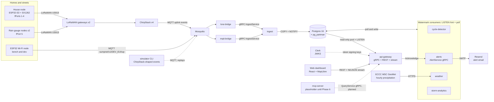

# sumpnet

Sump pumps are the last line of defence for basements in a modern subdivision, and nobody knows
how they behave during a storm until one fails. sumpnet instruments a neighbourhood of them (pit
level, pump current, float switch, mains power) over LoRaWAN and turns the data into
street-by-street storm response, early warning of failing pumps, and outage-risk alerts.

Pilot neighbourhood: Timberwalk, Ilderton (Middlesex Centre, Ontario). The specification and
roadmap live in [`prompt_plan.md`](prompt_plan.md), the session log in [`progress.md`](progress.md),
the architecture maps in [`docs/README.md`](docs/README.md), and the decisions in
[`docs/adr/`](docs/adr/README.md).

## Architecture



One Go module, one binary per service under `cmd/`, shared packages under `internal/`. Contracts
are protobuf (`proto/`), with the generated code committed under `gen/go`. Everything runs locally
with Docker Compose; AWS is a second deployment target (Phase 8, not started).

More maps in [`docs/README.md`](docs/README.md): one uplink's
[data flow](docs/README.md#data-flow-one-uplink), the [data model](docs/README.md#data-model),
the [repository layout](docs/README.md#repository-layout) and the
[API reference](docs/README.md#api-reference).

## Quickstart

Requires Go 1.26+, Docker with Compose v2, `make`, and Node 22.12+ for the dashboard.

```bash
make tools          # buf, golangci-lint, sqlc, migrate into ./bin (versions in .versions.env)
make up             # creates deploy/compose/.env from .env.example, builds, waits for every healthcheck
make ps             # every service should be "healthy"

make seed           # illustrative Timberwalk streets + the simulator's 60 homes and devices (SEED=42 HOMES=60)
make sim SCENARIO=storm50 SEED=42 SPEED=60   # 50 mm storm, 60 homes, 60x speed (about 24 min); truth -> loadtest/results/

cp web/.env.example web/.env.local           # optional: VITE_CLERK_PUBLISHABLE_KEY enables owner sign-in
make web-install && make web-dev             # dashboard on https://dev.ecoworks.ca:3034

make alerts-testmail   # optional: one delivery check once SMTP_* and ALERTS_TO are set in deploy/compose/.env
```

Notes for a fresh machine:

- Run `make seed` before `make sim`. Devices the seed has not linked to a home are auto-registered
  unlinked, and unlinked devices never appear in owner views or public aggregates.
- To link your Clerk user to simulated home 0, set `CLERK_ISSUER` in `deploy/compose/.env` and run
  `make seed DEMO_OWNER_SUBJECT=user_...` (or set `DEMO_OWNER_SUBJECT` there).
- For replays of simulated storms, set `WEATHER_ECCC_ENABLED=false` in `deploy/compose/.env`, so
  live Environment Canada data does not mix with simulated rain.
- The api-gateway and the Vite dev server serve TLS with the shared mkcert certificate in
  `~/Code/.traefik/certs`. Without it both fall back to plain HTTP; then set
  `API_PROXY_TARGET=http://localhost:3134` in `web/.env.local`.
- The ChirpStack UI is on `dev.ecoworks.ca:3131` over plain HTTP (admin/admin).

Development loop: `make lint`, `make test`, `make test-integration` (Docker), `make proto` after
editing `proto/`, `make sqlc` after editing `internal/store/queries/` or `migrations/`, and
`make web-test` for the dashboard. Database: `make migrate-up`, `make migrate-new NAME=add_thing`,
`make db-shell`.

## Services and ports

Host ports come from `deploy/compose/.env` and are registered for this Mac in `~/.claude/PORTS.md`.

| Service | Host port | Container port | Protocol |
|---|---|---|---|
| Web dashboard (Vite dev server on the host) | 3034 | none | HTTPS: `https://dev.ecoworks.ca:3034` |
| api-gateway REST, NDJSON stream, `/healthz` `/readyz` `/metrics` | 3134 | 8080 | HTTPS: `https://dev.ecoworks.ca:3134` (HTTP without the cert) |
| alerts `AlertService` gRPC (reflection on, no auth) | 3135 | 9091 | gRPC, plaintext |
| ChirpStack web UI and API | 3131 | 8080 | HTTP |
| Mosquitto (sumpnet's own broker) | 3133 | 1883 | MQTT |
| Postgres 16 + pg_partman | 5444 | 5432 | PostgreSQL |
| chirpstack-gateway-bridge (profile `gateways`, Phase 7) | 1700/udp | 1700/udp | Semtech UDP |

Internal to the compose network: ingest gRPC `:9090`, api-gateway gRPC `:9092`, each Go service's
ops listener `:8080` (the gateway's moves to `:8081`), and Redis (used by ChirpStack).

## Subsystems

### Ingest

`lora-bridge` consumes ChirpStack's uplink events and `mqtt-bridge` consumes ESP32 nodes on the
Wi-Fi transport ([`docs/node-mqtt.md`](docs/node-mqtt.md)). Both decode the same `internal/codec`
bytes (fPorts 1 to 5) and stream batches to `ingest` over gRPC. `ingest` writes with `COPY` into a
staging table and `INSERT … ON CONFLICT DO NOTHING`, so it is idempotent on
`(device_id, event time, f_cnt)`. Telemetry goes into monthly partitions managed by pg_partman.
Each batch sends a `NOTIFY sumpnet_ingest` hint in the same transaction. A bridge acknowledges an
MQTT message only after ingest commits, so a crash means redelivery, never loss.

### Detection and alerts

`cycle-detector` and `alerts` follow ADR 0003: they `LISTEN` for the hint and poll by a persisted
watermark, committing their writes with it. The detector annotates every cycle with its estimated
volume and applies the §10 rules: dry run, short cycling (also from storm-mode summaries) and
continuous run. It hands detections to `alerts` through the `detections` table.

`alerts` turns node alarms, heartbeat conditions and detections into one open alert per device and
condition, and resolves them on the evidence. It serves `alerts.v1.AlertService` and emails WARNING
and CRITICAL alerts to one operator address. Email goes through a transactional SMTP provider,
Resend by default (`smtp.resend.com`, the API key as password, a verified sender domain). An empty
`SMTP_HOST` logs instead of sending, and `make alerts-testmail` checks delivery.

### Weather and storm analytics

Two tipping-bucket rain gauge nodes at opposite ends of the neighbourhood report a cumulative tip
counter on fPort 5. `weather` turns consecutive counters into `rainfall` rows, so a lost uplink
loses no rain. It also polls Environment and Climate Change Canada's hourly observations for
LONDON CS (climate ID 6144478) through the MSC GeoMet API, as the fallback and cross-check.

`storm-analytics` groups the rain into storm events (at least 5 mm, gaps under 6 h). For each linked
home it computes lag, recession, volume, cycles and the baseflow they were measured against, from a
water balance of pit levels and pump cycles. It recomputes from the database whenever rain or
telemetry change, so replays and late data converge
([ADR 0007](docs/adr/0007-storm-analytics.md)).

`internal/e2e/phase4_integration_test.go` checks the results against the simulator's ground truth:
recession within ±10 % for every home, and lag within ±10 % or 15 minutes, whichever is larger
(one heartbeat interval; tolerance approved by the owner on 2026-09-12).

Each home's storm volume is stored two ways. `volume_l` sums the §9 pit-level drop per cycle and is
kept as a conservative floor, because it leaves out water that flows in while the pump runs.
`inflow_est_l` is the home's pump rate, calibrated on the dry-weather cycles baseflow uses, times run
time (migration 0006, PR #9). In the same e2e the pump rate is within 5 % of the simulator's and
`inflow_est_l` within 2.2 % of the true storm plus baseflow inflow, where `volume_l` was 8–62 % low.
The API does not serve `inflow_est_l` yet.

```bash
# A 50 mm storm with a 3-day dry lead (baseflow history) and a 3-day tail (recession), unpaced:
make sim SCENARIO=storm50-long SEED=42 SPEED=0 HOMES=16
```

### API gateway and dashboard

`api-gateway` serves `query.v1.QueryService` over gRPC and over REST (grpc-gateway), with the REST
port on `https://dev.ecoworks.ca:3134`. Public calls return street-segment aggregates only. They are
built by `internal/privacy` and suppressed below three reporting homes. Owners sign in with Clerk
and see only their own homes and alerts; anyone else's home is simply "not found".
`WatchNeighbourhood` streams live segment status and storm events to everyone, and alerts only to
their owner. Decisions: [ADR 0005](docs/adr/0005-privacy-thresholds.md) and
[ADR 0006](docs/adr/0006-api-gateway-auth.md).

`web/` is the dashboard (Vite, React, MapLibre). It shows a live heatmap of pump activity per
street, with privacy-hidden streets drawn hatched and explained. It also has a storm replay gauge,
an owner view with alert acknowledgement, and an About dialog (changelog, how it works, roadmap).

### Simulator

`cmd/simulator` is a deterministic model of the neighbourhood: 60 homes across 8 street segments
(standard, wooded, near the pond, high ground), each with its own pit geometry, baseflow, rain
response lag, recession time and pump health. Eight rainfall scenarios drive a linear-reservoir
hydrology model: `dry-week`, `storm25`, `storm50`, `storm25-long`, `storm50-long`, `thaw50`,
`outage` and `failing-pump` (`go run ./cmd/simulator -list-scenarios`). Two rain gauge nodes
(`-rain-gauges`, default 2) report what fell. An emulated node firmware turns the pump cycles into
the same binary payloads the ESP32-S3 house nodes will send, including storm-mode roll-ups and
alarms.

The same seed always produces the same byte stream, and the exported truth file holds each home's
realised lag, recession and volume for every storm. That lets the analytics be tested against known
answers.

```bash
go run ./cmd/simulator -scenario storm50 -seed 42 -sink stdout -hash > events.jsonl   # JSONL out, stream hash on stderr
```

## Status

| Phase | State |
|---|---|
| 0: Scaffold (module, compose stack, CI) | done 2026-09-11 |
| 1: Contracts + simulator | done 2026-09-11 |
| 2: Ingest path | done 2026-09-11 |
| 3: Cycle detection + alerts | done 2026-09-11; merged with Resend email 2026-09-12 |
| 4: Weather + storm analytics | done 2026-09-12 (lag tolerance "±10 % or 15 min" approved); pump-rate storm inflow estimate added (PR #9) |
| 5: API gateway + dashboard | built 2026-09-12; acceptance test passes; live storm replay on the map still to be checked |
| 6: MCP server | not started (placeholder service) |
| 7: Firmware + first real nodes | not started |
| 8: AWS + load test | not started |
| 9: Pilot | not started |

Details and acceptance evidence per phase: [`progress.md`](progress.md). Release notes:
[`CHANGELOG.md`](CHANGELOG.md).

## Load-test results

Phase 8 has not started, so there are no numbers yet. The plan: the simulator drives 1k, 10k and
50k devices in storm mode against the AWS stack, and the full write-up goes in
`loadtest/results/README.md`.

| Devices | Ingest p50 | Ingest p99 | Throughput | DB write rate | Cost / month |
|---|---|---|---|---|---|
| 1,000 | not measured | not measured | not measured | not measured | not measured |
| 10,000 | not measured | not measured | not measured | not measured | not measured |
| 50,000 | not measured | not measured | not measured | not measured | not measured |

## What I'd do differently at 1M devices

These choices fit a 60-home pilot. Each ADR names the point where it stops fitting. None of this is
measured yet; the Phase 8 load test will show which limit bites first.

- **Eventing.** A single Postgres `NOTIFY` channel plus watermark polling (ADR 0003) keeps the stack
  small. At a million devices I would move to a durable log such as NATS JetStream or Kafka, with
  partitioned consumers, so consumers scale out and can replay without scanning `inserted_at`.
- **Storage.** A heartbeat every 15 minutes is 96 rows a day per device, so a million devices write
  about 96 million `readings` rows a day before cycles. Monthly partitions on one database (ADR 0004)
  would not hold that. I would distribute by device (Citus or per-region databases) and keep raw
  telemetry short-lived behind rollups.
- **Storm analytics.** `storm-analytics` recomputes affected storms and homes from source on every
  change (ADR 0007). At scale it would work on materialised per-home inflow series, sharded by
  neighbourhood, with incremental updates.
- **Live map.** The gateway hub recomputes the whole neighbourhood each round (ADR 0006). At scale
  that becomes per-neighbourhood hubs fed by pre-aggregated segment rollups, with fan-out through a
  pub/sub layer instead of one process.
- **Ingest.** The bridges already support MQTT shared subscriptions (`MQTT_SHARED_GROUP`) and
  stateless gRPC batches. The network server and broker tier (ChirpStack, Mosquitto) would need
  clustering and per-region deployment.
- **Tenancy.** The schema assumes one neighbourhood. Many municipalities would need tenant scoping
  on segments, homes and owner links, and per-tenant privacy review.

## Decisions (ADRs)

| ADR | Decision |
|---|---|
| [0001](docs/adr/0001-monorepo.md) | Single Go module monorepo |
| [0002](docs/adr/0002-generated-code.md) | Commit generated protobuf code under `gen/go` |
| [0003](docs/adr/0003-eventing.md) | Service-to-service eventing: Postgres LISTEN/NOTIFY |
| [0004](docs/adr/0004-partitioning.md) | Time-series storage: native partitioning + pg_partman |
| [0005](docs/adr/0005-privacy-thresholds.md) | Privacy thresholds: segment aggregation with k ≥ 3 |
| [0006](docs/adr/0006-api-gateway-auth.md) | api-gateway: Clerk owner auth, one gRPC surface, private neighbourhood stream |
| [0007](docs/adr/0007-storm-analytics.md) | Storm analytics: recompute from source, gauge-first rainfall |
