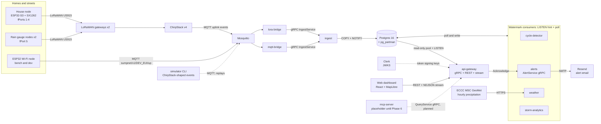
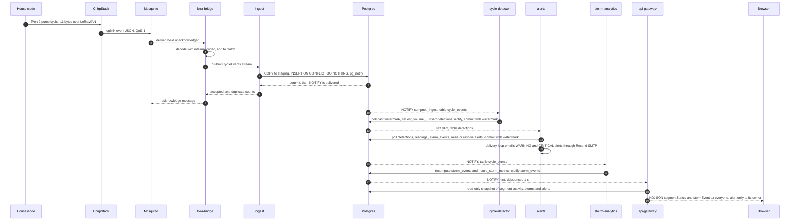
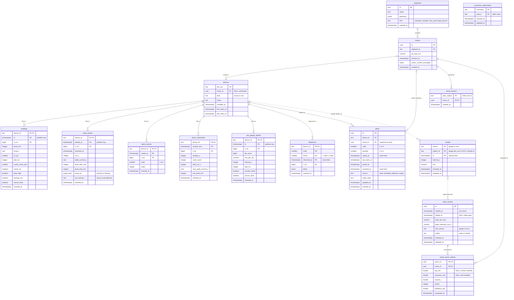

# sumpnet architecture

sumpnet turns sump-pit sensors in volunteer homes into street-level storm response and owner
alerts. This page maps the running system: services, data flow, data model, repository layout, API
and deployment. [`prompt_plan.md`](../prompt_plan.md) is the specification, [`adr/`](adr/README.md)
records the decisions, and the root [`README.md`](../README.md) has the quickstart and status.

## System overview



Solid arrows are built and running. Dotted arrows are the simulator (an input used for replays),
Clerk's public signing keys, and the planned MCP server. The LoRaWAN gateway leg needs the
`gateways` compose profile and real hardware (Phase 7); until then the simulator publishes
ChirpStack-shaped events straight to Mosquitto.

## Services and ports

| Service | Role | Reads | Writes | Listens (container) | Host port |
|---|---|---|---|---|---|
| `lora-bridge` | Decode ChirpStack uplinks | MQTT `application/+/device/+/event/up` | `IngestService` stream | ops `:8080` | none |
| `mqtt-bridge` | Decode Wi-Fi envelope uplinks | MQTT `sumpnet/v1/+/up` | `IngestService` stream | ops `:8080` | none |
| `ingest` | Idempotent storage of telemetry | gRPC from the bridges | `readings`, `cycle_events`, `storm_summaries`, `alarm_events`, `rain_gauge_uplinks`, `devices`; NOTIFY | gRPC `:9090`, ops `:8080` | none |
| `cycle-detector` | §10 cycle rules | `cycle_events`, `storm_summaries` | `cycle_events.est_volume_l`, `detections`; NOTIFY | ops `:8080` | none |
| `alerts` | Alert lifecycle and email | `alarm_events`, `readings`, `detections`, `rainfall` | `alerts`; email via SMTP | gRPC `:9091`, ops `:8080` | 3135 |
| `weather` | Rainfall | `rain_gauge_uplinks`; ECCC GeoMet over HTTPS | `rainfall`; NOTIFY | ops `:8080` | none |
| `storm-analytics` | Storm events and per-home response | `rainfall` (by `updated_at`), `readings`, `cycle_events`, `storm_summaries` | `storm_events`, `home_storm_metrics`; NOTIFY | ops `:8080` | none |
| `api-gateway` | Public and owner API, live stream | read-only pool + LISTEN; Clerk JWKS | calls `AlertService.Acknowledge` | REST `:8080` (TLS), gRPC `:9092`, ops `:8081` | 3134 |
| `mcp-server` | Placeholder until Phase 6 | none | none | ops `:8080` | none |
| `simulator` (CLI) | Deterministic replay | scenario | MQTT events, truth JSON | none | none |
| `seed` (CLI) | Demo neighbourhood | `internal/seed/segments.geojson`, simulator parameters | `segments`, `homes`, `devices`, `home_owners` | none | none |

Every consumer also writes its own rows in `consumer_watermarks`.

Infrastructure and host-side ports:

| Component | Host port | Container port | Notes |
|---|---|---|---|
| Web dashboard (Vite dev server on the host) | 3034 | none | `https://dev.ecoworks.ca:3034`; port fixed in `web/vite.config.ts` |
| api-gateway REST | 3134 | 8080 | `https://dev.ecoworks.ca:3134`; plain HTTP when the mkcert cert is absent |
| alerts gRPC | 3135 | 9091 | plaintext, unauthenticated; owners go through the gateway |
| ChirpStack v4 UI and API | 3131 | 8080 | plain HTTP |
| Mosquitto 2 | 3133 | 1883 | sumpnet's own broker |
| Postgres 16 + pg_partman 5 | 5444 | 5432 | hosts the `sumpnet` and `chirpstack` databases |
| Redis 7 | none | 6379 | ChirpStack only |
| chirpstack-gateway-bridge | 1700/udp | 1700/udp | profile `gateways` (Phase 7) |

Every Go service serves `/healthz`, `/readyz` and Prometheus `/metrics` on its ops listener, and the
container healthcheck runs the binary's `healthcheck` subcommand. Host ports come from
`deploy/compose/.env` (`CHIRPSTACK_PORT`, `MQTT_PORT`, `API_PORT`, `ALERTS_GRPC_PORT`,
`POSTGRES_PORT`, `GW_UDP_PORT`). `WEB_PORT` in `.env.example` is informational: Vite reads its port
from its own config.

## Data flow: one uplink

One pump cycle from a house node, through storage, detection, alerting and storm analytics, to the
browser:



### Eventing rules (ADR 0003)

- There is one channel, `sumpnet_ingest`. The payload is a wake-up hint,
  `{"table":…,"n":…,"min_ts":…,"max_ts":…}`, with no device ids. It is sent inside the writing
  transaction, so it arrives only after commit.
- Notifying writers: `ingest` (telemetry tables), `cycle-detector` (`detections`), `weather`
  (`rainfall`) and `storm-analytics` (`storm_events`).
- Consumers (`internal/watermark`) treat NOTIFY as a hint only. The truth is a poll by `inserted_at`
  past a persisted watermark, which excludes rows younger than `WATERMARK_LAG` (5 s) and never splits
  an `inserted_at` group. A timer (`POLL_INTERVAL`, 30 s) covers missed notifications. The poll,
  the handler's writes and the watermark update commit in one transaction.
- `storm-analytics` polls `rainfall` by `updated_at`, because `weather` rewrites rows when ECCC
  revises an hour or a late gauge uplink re-splits an interval. Writers bump `updated_at` only on a
  real change.
- The api-gateway hub also LISTENs (debounce `WATCH_DEBOUNCE`, 1 s; safety-net recompute
  `WATCH_POLL_INTERVAL`, 10 s). Each round recomputes the neighbourhood in one read-only
  transaction and sends only what changed.
- Every event timestamp (alert `raised_at`/`resolved_at`, detection `observed_at`, storm onset and
  end) is event time, never wall clock. The one wall-clock rule is the alerts OFFLINE sweep
  (`ALERTS_OFFLINE_AFTER`, 0 disables it for replays).

## Data model

Tables from migrations `0001` to `0005`. Radio metadata columns on the telemetry tables (`rssi_dbm`,
`snr_db`, `sf`, `gateway_id`, `dedup_id`) are left out of the diagram. Solid relationships are
foreign keys; dotted ones are logical links with no foreign key.



| Migration | Adds |
|---|---|
| `0001_base` | `segments`, `homes`, `devices`, `readings`, `cycle_events`, `storm_summaries`, `alarm_events`, enum `pump_kind` |
| `0002_partman` | monthly pg_partman partitions for `readings` and `cycle_events` (from 2026-01, 2 months ahead) |
| `0003_alerts` | `alerts` (one open row per device and code), `detections`, `consumer_watermarks`, `inserted_at` indexes |
| `0004_storms_owners` | `segments.kind`, `rainfall`, `storm_events`, `home_storm_metrics`, `home_owners` |
| `0005_rain_gauges` | `rain_gauge_uplinks` (monthly partitions), `rainfall(updated_at)` index |

In review, not merged: PR #9 adds migration `0006_pump_rate` (a pump-rate storm inflow estimate on
`home_storm_metrics`).

Single writers: `ingest` owns the telemetry tables, `cycle-detector` owns `detections` and
`est_volume_l`, `alerts` owns `alerts`, `weather` owns `rainfall`, and `storm-analytics` owns
`storm_events` and `home_storm_metrics`. `cmd/seed` (or an operator) writes `segments`, `homes`,
device links and `home_owners`. The api-gateway pool is read-only.

## Tech stack

| Layer | Choice |
|---|---|
| Services | Go 1.26, one module; `internal/platform` (slog JSON, `/healthz` `/readyz` `/metrics`, graceful shutdown) |
| Contracts | Protobuf managed by buf 1.72; gRPC; grpc-gateway v2 REST; generated code committed (ADR 0002) |
| Messaging | Mosquitto 2 (MQTT), `eclipse/paho.golang` (MQTT v5) in the bridges and simulator |
| LoRaWAN | ChirpStack v4 (US915), Redis 7 for ChirpStack |
| Storage | Postgres 16 with pg_partman 5 (ADR 0004); pgx/v5 + sqlc 1.31; golang-migrate 4.19 |
| Eventing | Postgres LISTEN/NOTIFY hints + watermark polls (ADR 0003) |
| Auth | Clerk session JWTs verified in the gateway with `golang-jwt/jwt/v5` + `MicahParks/keyfunc/v3` (ADR 0006) |
| Privacy | `internal/privacy`, k ≥ 3 reporting homes per public segment aggregate (ADR 0005) |
| Email | Stdlib SMTP notifier (STARTTLS, implicit TLS); Resend as the provider; Mailpit in tests |
| Weather | ECCC MSC GeoMet OGC API, collection `climate-hourly`, station LONDON CS 6144478 |
| Dashboard | Vite 8, React 19, TypeScript 6, MapLibre GL 6, `@clerk/react` 6, Vitest; Node 22.12+ |
| Tests | Table-driven unit tests; testcontainers-go (Postgres, Mosquitto, Mailpit) behind the `integration` tag |
| Lint | golangci-lint 2.13 (errcheck, govet, staticcheck, revive, gosec, ineffassign, unused); buf lint and format |
| Build and CI | One multi-stage distroless `Dockerfile` (`--build-arg SERVICE`); GitHub Actions |
| Local stack | Docker Compose (`deploy/compose`); Vite dev server on the host |

## Repository layout

```
sumpnet/
├── cmd/                      one main package per binary
│   ├── simulator/            CLI: deterministic neighbourhood replay (compose profile sim)
│   ├── seed/                 CLI: demo segments, homes, devices, owner link (make seed)
│   ├── lora-bridge/          ChirpStack uplink events -> ingest
│   ├── mqtt-bridge/          Wi-Fi envelope uplinks -> ingest
│   ├── ingest/               IngestService: idempotent bulk writes + NOTIFY
│   ├── cycle-detector/       estimated volume, dry run, short cycling, continuous run
│   ├── alerts/               alert engine, email, AlertService; `alerts testmail`
│   ├── weather/              rainfall from gauges + ECCC GeoMet poller
│   ├── storm-analytics/      storm events + per-home storm metrics
│   ├── api-gateway/          QueryService over gRPC + REST, WatchNeighbourhood
│   └── mcp-server/           placeholder (ops endpoints only) until Phase 6
├── internal/
│   ├── platform/             config, slog, health/metrics endpoints, shutdown, healthcheck
│   ├── codec/                fPort 1-5 binary payloads with golden vectors
│   ├── chirpstack/           uplink topics and UplinkEvent JSON
│   ├── sim/                  simulator engine, scenarios, rain gauges, sinks, truth
│   ├── bridge/               shared MQTT consumer, bounded batchers, ingest client
│   ├── lorabridge/           ChirpStack event decoder
│   ├── nodebridge/           Wi-Fi envelope decoder
│   ├── ingest/               IngestService server, bounded batch queue
│   ├── store/                pgx pool, COPY bulk path, NOTIFY; queries/*.sql -> sqlcgen/
│   ├── watermark/            ADR 0003 consumer: LISTEN hint + watermark poll
│   ├── hydrology/            §10 analytics as pure functions
│   ├── detector/             cycle-detector body
│   ├── alerts/               rules, engine, SMTP notifier, AlertService server
│   ├── weather/              gauge consumer, ECCC client; testdata/ recorded pages
│   ├── storms/               storm-analytics body
│   ├── privacy/              k >= 3 segment aggregates (ADR 0005)
│   ├── auth/                 Clerk JWT verifier, gRPC interceptors; authtest/ test JWKS
│   ├── gateway/              QueryService, WatchNeighbourhood hub, REST, CORS, TLS
│   ├── seed/                 segments.geojson (illustrative outlines) + seeding
│   ├── domain/               sentinel errors
│   ├── testinfra/            testcontainers helpers: Postgres, Mosquitto, Mailpit
│   ├── testpipeline/         in-process pipeline helpers for tests
│   └── e2e/                  Phase 3, 4 and 5 acceptance tests (integration tag)
├── proto/sumpnet/            telemetry/v1, query/v1, alerts/v1
├── gen/go/                   generated protobuf, gRPC and grpc-gateway code (ADR 0002)
├── migrations/               0001-0005 SQL for golang-migrate, embedded by embed.go
├── deploy/compose/           docker-compose.yml, .env.example, chirpstack/, mosquitto/,
│                             chirpstack-gateway-bridge/, postgres/initdb/
├── web/                      dashboard: src/components, src/lib, src/auth, src/about.ts
├── docs/                     README.md (this map), node-mqtt.md, adr/
├── loadtest/results/         make sim truth exports (gitignored JSON)
├── .github/                  workflows/ci.yml, dependabot.yml
├── Dockerfile                one distroless image, --build-arg SERVICE=<name>
├── Makefile, .versions.env   make targets; pinned tool versions shared with CI
├── buf.yaml, buf.gen.yaml, sqlc.yaml, .golangci.yml
└── README.md, CHANGELOG.md, CLAUDE.md, prompt_plan.md, progress.md
```

Planned, not in the tree yet: `firmware/` and `docs/rf-survey.md` (Phase 7), `deploy/terraform/`,
load-test scripts and `loadtest/results/README.md` (Phase 8).

## API reference

### REST (api-gateway, `https://dev.ecoworks.ca:3134`)

Routes come from the `google.api.http` annotations in `proto/sumpnet/query/v1/query.proto`. REST is
JSON with protojson field names (camelCase), enums as strings and unset messages as `null`. Send
`Authorization: Bearer <Clerk session token>` for owner calls.

| Method | Path | RPC | Access |
|---|---|---|---|
| GET | `/v1/segments` | ListSegments | public |
| GET | `/v1/storm-events?since=&until=&page_size=&page_token=` | ListStormEvents | public, newest first |
| GET | `/v1/storm-events/{storm_id}` | GetStormEvent | public, segment aggregates only |
| GET | `/v1/neighbourhood:watch?send_snapshot=true&segment_ids=` | WatchNeighbourhood | public; alerts only to their owner |
| GET | `/v1/homes/{home_id}` | GetHome | owner of that home |
| GET | `/v1/me/homes` | ListMyHomes | owner |
| GET | `/v1/me/alerts?home_id=` | ListMyAlerts | owner |
| POST | `/v1/me/alerts/{alert_id}:acknowledge` | AcknowledgeMyAlert | owner of the alert's home |

Status codes: 401 for a missing token on owner RPCs or an invalid token on any RPC, 404 for
anything the caller does not own, and 400 for malformed ids or page tokens.

`/v1/neighbourhood:watch` is newline-delimited JSON, one `{"result":{"update":{…}}}` per line. A
line `{"error":{…}}` ends the stream. Each update carries `ts` and one of `segmentStatus`,
`stormEvent` or `alert`. With `send_snapshot=true` the stream starts with every segment's status,
open and recent storms, and (for an owner) their active alerts. `segmentStatus` covers the
`STATUS_WINDOW` (1 h) ending at the neighbourhood clock: the newest event time from a linked house
device, clamped to now, so replays of past storms animate the map.

The same port serves `/healthz`, `/readyz` and `/metrics`.

### gRPC

| Service | Address | Auth | RPCs |
|---|---|---|---|
| `sumpnet.query.v1.QueryService` | `api-gateway:9092` (compose network only) | Clerk token in `authorization` metadata | the eight RPCs above |
| `sumpnet.alerts.v1.AlertService` | `alerts:9091`, host port 3135 | none | `ListActiveAlerts`, `Acknowledge` |
| `sumpnet.telemetry.v1.IngestService` | `ingest:9090` (compose network only) | none | client streams `SubmitReadings`, `SubmitCycleEvents` (with storm summaries), `SubmitAlarms`, `SubmitRainGaugeReadings` |

QueryService and AlertService have server reflection enabled. `alerts.proto` carries HTTP
annotations (`/v1/alerts`), but no process serves AlertService over REST; owners acknowledge through
the gateway's `AcknowledgeMyAlert`.

### Auth model (ADR 0006)

- The gateway verifies Clerk session tokens itself: RS256 only, a key from the issuer's JWKS,
  `iss` equal to `CLERK_ISSUER`, `exp` required, `nbf`/`iat` within `CLERK_CLOCK_SKEW` (5 s), `sub`
  present, and `azp` in `CLERK_AUTHORIZED_PARTIES` when that is set.
- The JWKS (`CLERK_JWKS_URL`, default `<issuer>/.well-known/jwks.json`) is cached and refreshed
  hourly. A token with an unknown key id triggers a refresh at most once a minute. Since PR #8 that
  refresh request has a 10 s budget; it had 1 ms, so rotated keys were refused until the hourly
  refresh.
- No `authorization` header means an anonymous caller. A header that is not a valid token is
  `UNAUTHENTICATED` on every RPC, public ones included.
- The token subject maps to homes through `home_owners`. A home or alert the caller does not own is
  `NOT_FOUND`, indistinguishable from one that does not exist.
- An empty `CLERK_ISSUER` disables owner RPCs; public views keep working.
- REST is grpc-gateway proxying to the gateway's own gRPC listener over loopback, so interceptors,
  ownership checks and privacy code run once for both transports.
- Writes stay with their owners: the gateway pool sets `default_transaction_read_only`, and
  acknowledgement is an ownership check followed by `AlertService.Acknowledge`.

## Privacy (ADR 0005)

- Participation is opt-in and device ids are pseudonymous. Owner contact details stay encrypted in
  `homes.owner_contact_encrypted` and never appear in the API.
- Per-home data (`home_storm_metrics`, readings, cycles, alerts with a `home_id`) is served only on
  owner-scoped paths keyed on the caller's Clerk subject in `home_owners`.
- Every public view aggregates to a street segment through `internal/privacy` (`AggregateStorm`,
  `AggregateStatus`). A segment with fewer than `privacy.MinHomes` = 3 reporting linked homes is
  published with `suppressed: true` and every number zeroed, including the live cycle rate and alert
  count. Unlinked devices never count as reporting homes.
- The dashboard applies the rule again and draws suppressed streets hatched, with an explanation.
- `WatchNeighbourhood` routes alerts by `home_owners` at send time. Anonymous streams carry segment
  statuses and storm events only; the Phase 5 acceptance test asserts that no home id or DevEUI
  appears on one.
- The MCP server (Phase 6) must read through QueryService and so inherits the same rules. The
  threshold is a constant; changing it needs a new ADR.

## Deployment notes

- **Local stack.** `make up` runs `docker compose -f deploy/compose/docker-compose.yml up -d --build
  --wait`. A one-shot `migrate` service applies `migrations/` first, and every service that opens
  the database checks the schema version at startup and refuses to run on a stale one. `docker compose down -v` wipes both the sumpnet and chirpstack
  databases, which share one Postgres.
- **Profiles.** `sim` runs the simulator once inside compose (`make sim` runs it from the host
  instead). `gateways` adds chirpstack-gateway-bridge for real LoRaWAN gateways (Phase 7).
- **TLS.** Compose mounts `TLS_CERT_DIR` (default `~/Code/.traefik/certs`, the shared mkcert
  certificate for `*.dev.ecoworks.ca`) into the api-gateway read-only. `TLS_FALLBACK_HTTP=true`
  serves plain HTTP with a warning when the certificate cannot be loaded. The ops listener stays
  plain HTTP on `:8081` for the healthcheck. The Vite dev server uses the same certificate and falls
  back to HTTP without it.
- **Clerk.** Set `CLERK_ISSUER` and `CLERK_AUTHORIZED_PARTIES` in `deploy/compose/.env` and
  `VITE_CLERK_PUBLISHABLE_KEY` in `web/.env.local`, and allow `https://dev.ecoworks.ca:3034` as an
  origin in the Clerk dashboard. The gateway needs no Clerk secret (the JWKS is public).
- **CORS.** `WEB_ORIGIN` (default `https://dev.ecoworks.ca:3034`) is the only origin allowed to
  call the REST port directly. In development the Vite server proxies `/v1` same-origin to
  `API_PROXY_TARGET`.
- **Email.** `SMTP_HOST`, `SMTP_PORT`, `SMTP_USER`, `SMTP_PASSWORD`, `SMTP_FROM`, `SMTP_TLS` and
  `ALERTS_TO` in `.env`. For Resend: `smtp.resend.com`, port 465, user `resend`, the API key as
  password, and a sender on a Resend-verified domain. `SMTP_PASSWORD` is a secret and lives only in
  the gitignored `.env`.
- **Weather.** `WEATHER_ECCC_ENABLED`, `WEATHER_ECCC_STATION` (6144478),
  `WEATHER_ECCC_POLL_INTERVAL` (1h), `WEATHER_ECCC_BACKFILL` (168h), `WEATHER_ECCC_LOOKBACK` (48h).
  The poller needs outbound HTTPS to `api.weather.gc.ca`; disable it for simulator replays.
- **Lab VM.** The Ubuntu lab VM is the planned primary host and can use default ports in its `.env`.
  Development currently runs on the Mac with the registered ports above.
- **CI.** `.github/workflows/ci.yml` runs buf (lint, format, breaking on PRs, generated-code drift),
  golangci-lint with formatters and `sqlc diff`, `go test -race`, the integration tests, the web job
  (`npm ci`, lint, test, build), `docker compose config`, and a Docker build for each of the ten
  services. Images are built, not pushed.
- **AWS (Phase 8, not started).** Terraform for VPC, ECS Fargate per service, RDS Postgres with
  pg_partman, ALB (gRPC and HTTP), Secrets Manager and CloudWatch.

## Known gaps

- Street outlines in `internal/seed/segments.geojson` are illustrative, not surveyed.
- OpenStreetMap's public tiles suit light development use only; a pilot needs its own tile
  provider (`VITE_TILE_URL`).
- Phase 5's "live storm replay visible on the map" acceptance check has not yet been run in a
  browser against `make up`.
- `mcp-server` is a placeholder until Phase 6.
- Alert email goes to one operator address; per-owner email needs a decryption scheme for owner
  contacts (`prompt_plan.md` §14).
